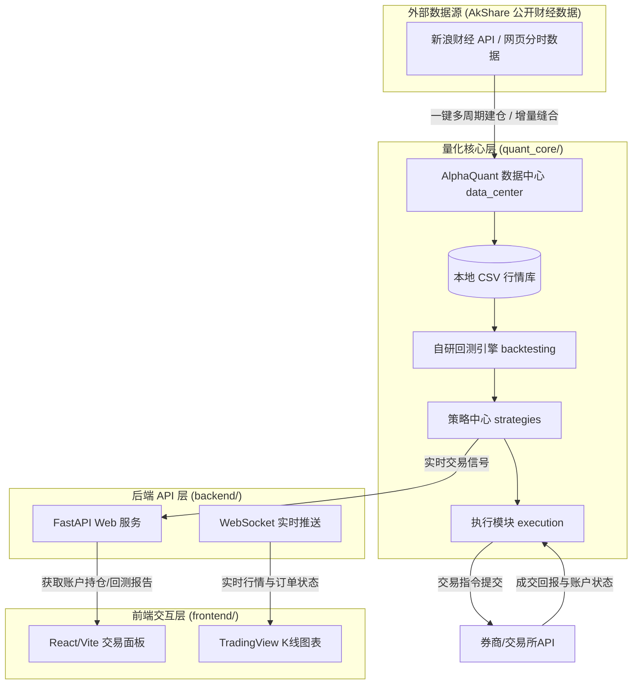

# 📊 AlphaQuant 智能量化交易系统

AlphaQuant 是一个面向未来的、前后端分离的闭环智能量化交易系统。该系统集成了**数据中心、回测引擎、策略中心、模拟/实盘执行**四大核心功能，并提供直观且富科技感的**前端交易仪表盘（Dashboard）**，帮助交易者实现从策略研发到实盘运行的一站式闭环。

---

## 🏗️ 系统架构设计

系统采用**高内聚、低耦合**的分层模块化设计。通过 Python 强大的数据处理生态负责策略计算与数据流转，通过 FastAPI 构建高效的异步 API，前端使用 React/Vite 进行动态交易可视化与监控。



---

## 📁 目录结构规划

```text
quant-trading/
├── data/                      # [LOCAL ONLY] 存放本地高频及历史 K 线数据文件 (已加入 .gitignore)
├── quant_core/                # 量化核心底层
│   ├── __init__.py
│   ├── data_pipeline/         # 行情数据中心模块
│   │   ├── __init__.py
│   │   ├── fetch_data.py      # 日线历史下载模块
│   │   └── data_center.py     # [CORE] 全市场多周期增量缝合与本地重采样中心
│   ├── strategies/            # 交易策略中心（存放各类策略逻辑，如双均线等）
│   ├── backtesting/           # 回测引擎模块（读取历史数据，计算夏普、回撤等指标）
│   └── execution/             # 模拟盘/实盘交易执行模块（对接 API 下单）
├── backend/                   # 后端 Web API 层（使用 FastAPI 包装算法接口）
│   ├── app/
│   │   ├── api/               # API 路由接口 (策略配置, 账户持仓, 回测触发)
│   │   ├── core/              # 系统基础配置与安全设置
│   │   ├── models/            # 数据库ORM模型
│   │   ├── services/          # Web 业务逻辑层
│   │   └── main.py            # FastAPI 启动文件
│   ├── requirements.txt       # 后端依赖包
│   └── .env                   # 敏感环境变量（API Key、数据库链接等）
├── frontend/                  # 前端 Web 交互层（Vite + React + TS）
│   ├── src/
│   │   ├── components/        # 页面组件（K线图、持仓表、回测配置器）
│   │   ├── hooks/             # 自定义 React Hooks
│   │   ├── views/             # 页面视图 (Dashboard, Backtest, settings)
│   │   └── App.tsx
│   ├── package.json           # 前端依赖与构建脚本
│   └── vite.config.ts
├── .gitignore                 # Git 忽略文件（保护敏感资产和大体积数据）
├── .env.example               # 环境变量配置模板
└── README.md                  # 本设计白皮书
```

---

## 🗄️ 行情数据中心 (Data Center) 操作指南

我们设计了一套**高内聚、零付费限制、免登录**的“中央行情数据中心”：[data_center.py](file:///D:/ai/quant-trading/quant_core/data_pipeline/data_center.py)。它覆盖了国内期货市场 **55 个核心主力连续合约**，并支持以下高级特性：

### 1. 2000年至今的历史日线一键建仓
我们彻底打通了历史追溯通道，支持一键获取自 **2000年1月1日** 至今长达 26 年的日线历史数据。若品种在 2000 年之后上市，系统会自动聪明的识别并自其上市首日开始完整拉取。

### 2. 高频分钟线“增量缝合去重”引擎
针对公网分钟级数据“只存最近 1023 条滚动队列”的技术局限，我们编写了**缝合追加算法**：
* 每次运行下载时，自动读取本地现有 CSV 历史文件，提取最新一条记录的时间戳。
* 从云端抓取最新的 1023 条高频分钟线，自动过滤剔除已有的重复时间戳。
* 将新鲜出炉的分钟数据无缝追加（Append）到本地文件末尾，日积月累，自动在您的本地积淀出一套**完全私有的、超长跨度的分钟级历史高频行情数据库**！

### 3. 高精度本地周/月/年线合成
为了避免云端拉取周/月/年线由于节假日对齐和时差导致的开高收低价失真，系统采用专业量化标准，**直接在本地高精度重采样（Resample）合成周线、月线与年线**！
* **周线 (Weekly)**: `future_{symbol}_weekly.csv`
* **月线 (Monthly)**: `future_{symbol}_monthly.csv`
* **年线 (Yearly)**: `future_{symbol}_yearly.csv`

### 🚀 如何一键运行数据中心
在您的终端中输入这行命令，即可启动全市场日线追溯、多维度分钟线同步以及本地重采样合成：
```bash
python quant_core/data_pipeline/data_center.py
```

---

## 🛠️ 技术栈选型

* **后端 (Backend)**:
  * **语言**: Python 3.10+
  * **Web 框架**: FastAPI (异步、超高性能、内置 OpenAPI 文档)
  * **数据处理**: Pandas, NumPy
  * **回测核心**: 自研极简高性能 Pandas 向量化/事件驱动回测引擎 (路线 B 🌟)
* **前端 (Frontend)**:
  * **构建工具**: Vite
  * **框架**: React + TypeScript
  * **可视化**: TradingView Lightweight Charts (轻量级交互式 K 线图)
  * **样式**: Vanilla CSS
* **数据库 (Database)**:
  * **开发阶段**: SQLite (简单高效，无需配置)
  * **生产阶段**: PostgreSQL / InfluxDB (时序数据首选)

---

## 🚀 启动与运行计划

### 1. 关联您的 GitHub 仓库
我们已经在本地初始化了 Git 仓库，您可以按照以下步骤将本地代码推送到您的私有 GitHub 仓库中：
1. 登录 [GitHub](https://github.com/)，在右上角点击 **New repository**。
2. 填入 Repository name: `quant-trading`。
3. 务必选择 **Private**（私有仓库，防止策略和敏感 API 泄露）。
4. 不要勾选 "Initialize this repository with..." 任何选项。
5. 点击 **Create repository**。
6. 在本地的 `D:\ai\quant-trading` 目录下运行终端，依次执行以下命令：
   ```bash
   git branch -M main
   git remote add origin https://github.com/pangbo0000/quant-trading.git
   git push -u origin main
   ```
*(注：如果因为 GitHub 远程自带空 README 导致 rejected，只需在终端追加运行 `git push -u origin main --force` 强行推送即可！)*
